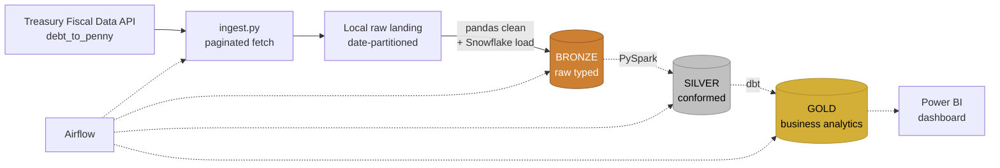

cat > README.md << 'EOF'
# Fiscal Data Pipeline

Daily-batch data pipeline ingesting U.S. Treasury Debt to the Penny data 
from the Fiscal Data API, transforming through a medallion architecture 
(raw → curated → analytics), and surfacing through a BI layer.

## Stack
- Ingestion: Python (`requests`)
- Storage: AWS S3 (raw + curated zones)
- Transform: PySpark
- Warehouse: Snowflake
- Modeling: dbt
- Orchestration: Airflow
- BI: Power BI

## Status
<!-- Walking skeleton in progress. See `ingest.py` for current state. -->
Current status: Bronze layer complete, Silver in progress

# Architecture Diagram
